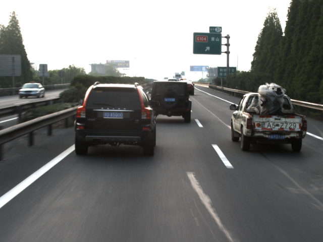
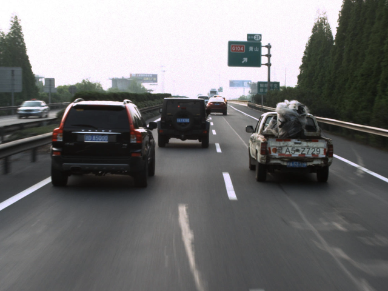
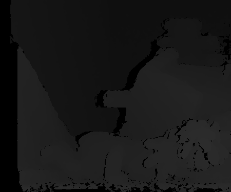
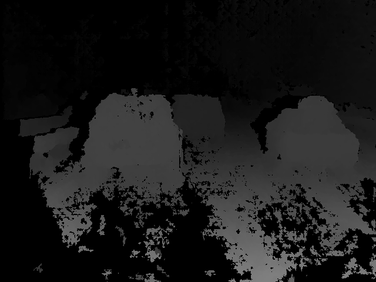
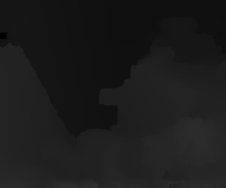

## SPS-Stereo: Slanted Plane Smoothing Stereo

SPS-Stereo is a dense stereo method employing a slanted plane model. It jointly estimates a superpixel segmentation, boundry labels (such as occlusion boundaries), and a dense depth estimate from a pair of stereo images.

**Citation**  

    @inproceedings{Yamaguchi14,
    author = {Koichiro Yamaguchi and David McAllester and Raquel Urtasun},
    title = {Efficient Joint Segmentation, Occlusion Labeling, Stereo and Flow Estimation},
    booktitle = {ECCV},
    year = {2014}
    }

### Building SPS-Stereo

1. Prerequisites
    * [libpng](http://www.libpng.org/pub/png/libpng.html)
    * [png++](http://www.nongnu.org/pngpp/)
    * CUDA(For GPU version only)
2. Building CPU Version
    1. type 'cmake .'
    2. type 'make'
3. Building GPU Version
    1. type './build.sh' or 'make'

### Usage of demo code

First, download KITTI stereo/flow dataset from [KITTI Vision Benchmark Suite homepage](http://www.cvlibs.net/datasets/kitti/eval_stereo_flow.php?benchmark=stereo) and extract it.

Run SPS-Stereo  
`> ./spsstereo data_stereo_flow/training/image_0/000000_10.png data_stereo_flow/training/image_1/000000_10.png`

**Outputs**  

* `000000_10_disp.png`  
Disparity image (PNG 16bit grayscale format)  
(Disparity value) = (Pixel value)/256.0

* `000000_10L_seg.png`  
Segmentation image (PNG 16bit grayscale format)  
(Segment ID) = (Pixel value)

* `000000_10L_plane.png`  
Estimated disparity planes  
the number of lines = the number of segments  
Each line includes parameters of disparity plane of a segment: `(A_i, B_i, C_i)`

* `000000_10L_label.txt`  
Boundary labeling result  
the number of lines = the number of boundaries  
Each line includes three entries: `SegmentID1 SegmentID2 boundary_label`  
`boundary_label`: 0 (Occlusion, SegmentID1 is front), 1 (Occlusion, SegmentID2 is front), 2 (Hinge), 3 (Coplanar)

* `000000_10L_boundary.png`  
Visualization of segmentation result  
Boundary color means a type of relationship between neighboring segments: Red/Blue-Occluion (Red side is front), Green-Hinge, Gray- Coplaner

### Exmaples

|                   | **Teddy**                             | **Car**                               |
| :-:               | :-:                                   | :-:                                   |     
| **Left**          |            |              |
| **Right**         |           |             |
| **SGM_disparity** |   |     |
| **SPS_disparity** |   |     |
| **ground_truth**  |          | **NA**                                |

### Notice
1. In the GPU version, the width or height of the input images can't be larger than 1024.
2. Change DISPARITY_TOTAL to set maximum disparity.
3. Change CONSISTENCY_THRESHOLD to set constraint for left and right consistency.

### Running time comparison
Setting the maximum disparity to 128, GPU version is about 5 times faster than CPU version, as shown in the table below.

| **Image Size**    | **GPU Version**   | **CPU Version**   |
| :-:               | :-:               | :-:               |
| 640*480           | 0.12s             | 0.50s             |
| 450*435           | 0.06s             | 0.30s             |
| 433*381           | 0.06s             | 0.30s             |

### License
SPS-Stereo is licensed under the GNU General Public License Version 3 (GPLv3), see [http://www.gnu.org/licenses/gpl.html](http://www.gnu.org/licenses/gpl.html).
